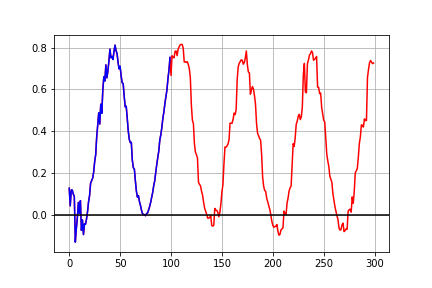
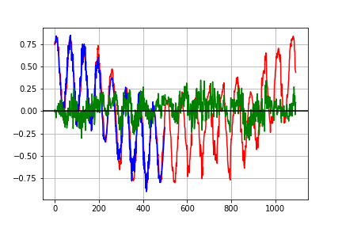

## Transformers-for-In-Air-Handwriting-Recognition

This code aims to build upon the time series transformers described in the paper ["A TRANSFORMER-BASED FRAMEWORK FOR MULTIVARIATE TIME SERIES REPRESENTATION LEARNING"](https://arxiv.org/abs/2010.02803).

## Loss after 100 Epochs

## Time Series forecast

