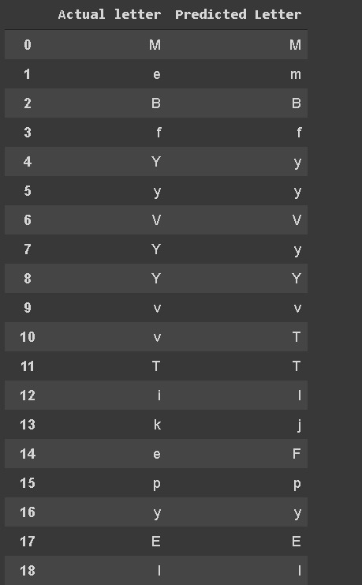

## Transformers-for-In-Air-Handwriting-Recognition

This code aims to build upon the time series transformers described in the paper ["A Transformer-based framework for multivariate time series representation learning"](https://arxiv.org/abs/2010.02803).

Currently, I am working with the following datasets:
- [The OnHW Dataset: Online Handwriting Recognition from IMU-Enhanced Ballpoint Pens with Machine Learning](https://stabilodigital.com/onhw-dataset/)
- [IAM On-Line Handwriting Database](https://fki.tic.heia-fr.ch/databases/iam-on-line-handwriting-database)

### Results of time series transformer after training for 100 Epochs on OnHW dataset:

## Loss after 100 Epochs

## Time Series forecast

